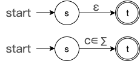
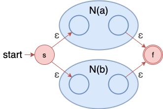
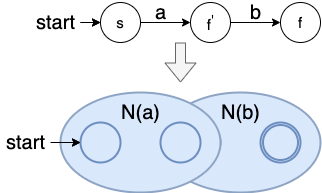
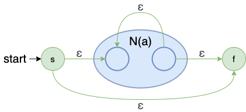
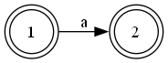
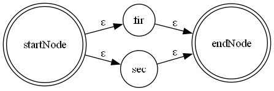
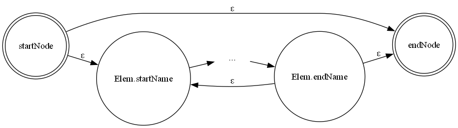
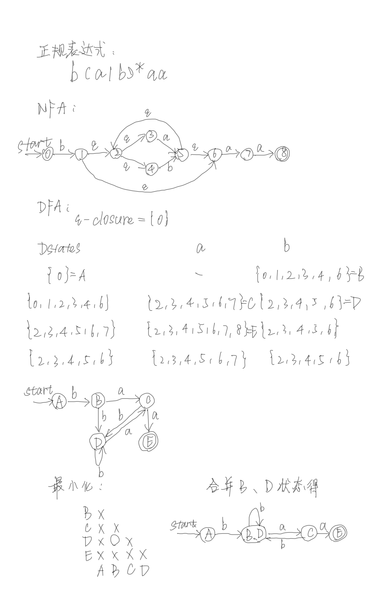

- [**2.1** 正规表达式转 NFA 算法及实现](#21-正规表达式转-nfa-算法及实现)
  - [2.1.1 实验目的](#211-实验目的)
  - [2.1.2 实验内容与实验要求](#212-实验内容与实验要求)
    - [2.1.2.1 实验内容](#2121-实验内容)
    - [2.1.2.2 实验要求](#2122-实验要求)
  - [2.1.3 设计方案与算法描述](#213-设计方案与算法描述)
    - [2.1.3.1 Thompson算法](#2131-thompson算法)
    - [2.1.3.2 结构体定义](#2132-结构体定义)
      - [NFA的节点定义](#nfa的节点定义)
      - [NFA的一条边定义（一个状态转移）](#nfa的一条边定义一个状态转移)
      - [存储整个NFA信息的结构体](#存储整个nfa信息的结构体)
    - [2.1.3.3 函数与功能](#2133-函数与功能)
      - [创建一个新的NFA节点](#创建一个新的nfa节点)
      - [处理 `a` 的状态（即新建一个NFA）](#处理-a-的状态即新建一个nfa)
      - [处理 `a|b` 的状态](#处理-ab-的状态)
      - [处理 `ab` 的状态](#处理-ab-的状态-1)
      - [处理 `a*`](#处理-a)
      - [其他功能](#其他功能)
    - [2.1.3.4 主要处理流程](#2134-主要处理流程)
  - [2.1.4 测试结果](#214-测试结果)
  - [2.1.5 源代码](#215-源代码)
    - [2.1.5.1 `re2nfa_head.h`](#2151-re2nfa_headh)
    - [2.1.5.2 `re2nfa_func.cpp`](#2152-re2nfa_funccpp)
    - [2.1.5.3 `main.cpp`](#2153-maincpp)
- [**2.2** NFA转DFA算法及实现](#22-nfa转dfa算法及实现)
  - [2.2.1 实验目的](#221-实验目的)
  - [2.2.2 实验内容与实验要求](#222-实验内容与实验要求)
    - [2.2.2.1 实验内容](#2221-实验内容)
    - [2.2.2.2 实验要求](#2222-实验要求)
  - [2.2.3 设计方案与算法描述](#223-设计方案与算法描述)
    - [2.2.3.1 算法描述](#2231-算法描述)
    - [2.2.3.2 结构体定义](#2232-结构体定义)
      - [DFA的状态](#dfa的状态)
      - [DFA的状态转移](#dfa的状态转移)
    - [2.2.3.3 函数与功能](#2233-函数与功能)
      - [计算 NFA 状态的ε闭包](#计算-nfa-状态的ε闭包)
      - [move函数](#move函数)
      - [检查 DFA 状态是否在状态集合中](#检查-dfa-状态是否在状态集合中)
      - [检查转换边是否在边集合中](#检查转换边是否在边集合中)
      - [从 NFA 构建 DFA](#从-nfa-构建-dfa)
      - [其他功能](#其他功能-1)
  - [2.2.4 测试结果](#224-测试结果)
  - [2.2.5 源代码](#225-源代码)
    - [2.2.5.1 `nfa2dfa_head.h`](#2251-nfa2dfa_headh)
    - [2.2.5.2 `nfa2dfa_func.cpp`](#2252-nfa2dfa_funccpp)
    - [2.2.5.3 `main.cpp`](#2253-maincpp)
- [**2.3** DFA最小化算法及实现](#23-dfa最小化算法及实现)
  - [2.3.1 实验目的](#231-实验目的)
  - [2.3.2 实验内容与实验要求](#232-实验内容与实验要求)
    - [2.3.2.1 实验内容](#2321-实验内容)
    - [2.3.2.2 实验要求](#2322-实验要求)
  - [2.3.3 设计方案与算法描述](#233-设计方案与算法描述)
    - [2.3.3.1 Hopcroft算法](#2331-hopcroft算法)
    - [2.3.3.2 C++实现](#2332-c实现)
  - [2.3.4 测试结果](#234-测试结果)
  - [2.3.5 源代码](#235-源代码)
    - [2.3.5.1 `head.h`](#2351-headh)
    - [2.3.5.2 `func.cpp`](#2352-funccpp)
    - [2.3.5.3 `main.cpp`](#2353-maincpp)


## **2.1** 正规表达式转 NFA 算法及实现

### 2.1.1 实验目的

1. 掌握正规表达式与有限⾃动机的基本概念和转换⽅法。
2. 了解⾮确定有限⾃动机（NFA）的构建过程。
3. 熟悉编程实现正规表达式到 NFA 转换的算法。
4. 提⾼编程能⼒和算法设计的技能

### 2.1.2 实验内容与实验要求

#### 2.1.2.1 实验内容

1. **理论背景**：正规表达式是⼀种⽤于描述词法单元的形式化表示法，⽽ NFA 是⼀种⽤于词法分析的状态机。正规表达式可以通过算法转化为 NFA，从⽽实现对字符串的模式匹配。
2. **任务描述**：实现正规表达式到 NFA 的转换算法，并验证⽣成的 NFA 对给定输⼊字符串的接受性。同时，设计适合 NFA 的数据结构，为后续 NFA 转 DFA、DFA 最⼩化等实验任务提供基础⽀持。
3. **实验步骤**：
   - 解析输⼊的正规表达式。
   - 构建对应的 NFA，包括处理基本符号、连接、并联（或操作）、闭包（星号操作）等运算。
   - 设计并实现合理的数据结构表示 NFA，如状态集合、转移关系、初始状态和接受状态。
   - 对 NFA 进⾏模拟，验证其是否接受给定的输⼊字符串。
4. **案例分析**：给定⼀个简单的正规表达式（如`a(b|c)*`），手动推导其 NFA，并用程序实现自动生成 NFA 的过程。

#### 2.1.2.2 实验要求

1. 输⼊输出要求：
   - 输⼊：正规表达式和多个测试字符串。
   - 输出：⽣成的 NFA 状态集合及其转换关系，指明每个测试字符串是否被 NFA 接受。
2. 算法要求：
   - ⽀持基本的正规表达式运算符，如连接`(ab)`、或`(a|b)`、闭包`a*`。
   - 实现 Thompson 构造法，将正规表达式分解为基本操作，然后逐步合成 NFA。
3. 数据结构要求：
   - 设计合理的数据结构来表示 NFA（如图的表示⽅式），应包括状态集、状态转移表、初始状态和接受状态的表示。
   - 数据结构需具备扩展性，以便在后续实验中使⽤，如 NFA 到 DFA 的转换、DFA 的最⼩化。
   - 考虑实现状态的唯⼀标识符，⽀持对状态进⾏增删查操作的⾼效实现。
4. 程序要求：
   - 使⽤ C/C++、Java、Python 等语⾔编写程序，代码结构清晰，具备良好的注释。
   - 提供详细的实验报告，包括算法设计、实现过程、测试结果和问题分析。
5. 实验报告要求：
   - 描述实验⽬的和内容。
   - 解释算法实现的步骤和数据结构的设计思路。
   - 给出测试⽤例和结果，分析测试数据的正确性。
   - 总结实验的收获和遇到的挑战。

### 2.1.3 设计方案与算法描述

采用了C++实现。

#### 2.1.3.1 Thompson算法

单个字符的NFA  



两个NFA的相交  



两个NFA的并集  



单个的NFA闭包


  

#### 2.1.3.2 结构体定义

##### NFA的节点定义
```cpp
struct node
{
    string nodeName;
};
```

##### NFA的一条边定义（一个状态转移）
```cpp
struct edge
{
    node startName;  // 起始点
    node endName;    // 目标点
    char tranSymbol; // 转换符号
};
```

##### 存储整个NFA信息的结构体
```cpp
struct elem
{
    int edgeCount;     // 边数
    edge edgeSet[100]; // 该NFA拥有的边
    node startName;    // 开始状态
    node endName;      // 结束状态
};
```

#### 2.1.3.3 函数与功能

##### 创建一个新的NFA节点
```cpp
node new_node();
```

##### 处理 `a` 的状态（即新建一个NFA）  


```cpp
elem act_Elem(char c)
{
    // 新节点
    node startNode = new_node();
    node endNode = new_node();

    // 新边
    edge newEdge;
    newEdge.startName = startNode;
    newEdge.endName = endNode;
    newEdge.tranSymbol = c;

    // 新NFA组成元素（小的NFA元素/单元)
    elem newElem;
    newElem.edgeCount = 0; // 初始状态
    newElem.edgeSet[newElem.edgeCount++] = newEdge;
    newElem.startName = newElem.edgeSet[0].startName;
    newElem.endName = newElem.edgeSet[0].endName;

    return newElem;
}
```

##### 处理 `a|b` 的状态  


```cpp
elem act_Unit(elem fir, elem sec)
{
    elem newElem;
    newElem.edgeCount = 0;
    edge edge1, edge2, edge3, edge4;

    // 获得新的状态节点
    node startNode = new_node();
    node endNode = new_node();

    // 构建e1（连接起点和AB的起始点A）
    edge1.startName = startNode;
    edge1.endName = fir.startName;
    edge1.tranSymbol = '#';

    // 构建e2（连接起点和CD的起始点C）
    edge2.startName = startNode;
    edge2.endName = sec.startName;
    edge2.tranSymbol = '#';

    // 构建e3（连接AB的终点和终点）
    edge3.startName = fir.endName;
    edge3.endName = endNode;
    edge3.tranSymbol = '#';

    // 构建e4（连接CD的终点和终点）
    edge4.startName = sec.endName;
    edge4.endName = endNode;
    edge4.tranSymbol = '#';

    // 将fir和sec合并
    elem_copy(newElem, fir);
    elem_copy(newElem, sec);

    // 新构建的4条边
    newElem.edgeSet[newElem.edgeCount++] = edge1;
    newElem.edgeSet[newElem.edgeCount++] = edge2;
    newElem.edgeSet[newElem.edgeCount++] = edge3;
    newElem.edgeSet[newElem.edgeCount++] = edge4;

    newElem.startName = startNode;
    newElem.endName = endNode;

    return newElem;
}
```

##### 处理 `ab` 的状态  
将fir的结束状态和sec的开始状态合并，将sec的边复制给fir，将fir返回  
将sec中所有以StartState开头的边全部修改  

```cpp
elem act_join(elem fir, elem sec)
{
    for (int i = 0; i < sec.edgeCount; i++)
    {
        if (sec.edgeSet[i].startName.nodeName.compare(sec.startName.nodeName) == 0)
        {
            sec.edgeSet[i].startName = fir.endName; // 该边e1的开始状态就是N(t)的起始状态
        }
        else if (sec.edgeSet[i].endName.nodeName.compare(sec.startName.nodeName) == 0)
        {
            sec.edgeSet[i].endName = fir.endName; // 该边e2的结束状态就是N(t)的起始状态
        }
    }
    sec.startName = fir.endName;

    elem_copy(fir, sec);

    // 将fir的结束状态更新为sec的结束状态
    fir.endName = sec.endName;
    return fir;
}
```

##### 处理 `a*` 



```cpp
elem act_star(elem Elem)
{
    elem newElem;
    newElem.edgeCount = 0;
    edge edge1, edge2, edge3, edge4;

    // 获得新状态节点
    node startNode = new_node();
    node endNode = new_node();


    // e1
    edge1.startName = startNode;
    edge1.endName = endNode;
    edge1.tranSymbol = '#'; // 闭包取空串

    // e2
    edge2.startName = Elem.endName;
    edge2.endName = Elem.startName;
    edge2.tranSymbol = '#';

    // e3
    edge3.startName = startNode;
    edge3.endName = Elem.startName;
    edge3.tranSymbol = '#';

    // e4
    edge4.startName = Elem.endName;
    edge4.endName = endNode;
    edge4.tranSymbol = '#';

    // 构建单元
    elem_copy(newElem, Elem);

    // 将新构建的四条边加入EdgeSet
    newElem.edgeSet[newElem.edgeCount++] = edge1;
    newElem.edgeSet[newElem.edgeCount++] = edge2;
    newElem.edgeSet[newElem.edgeCount++] = edge3;
    newElem.edgeSet[newElem.edgeCount++] = edge4;

    // 构建NewElem的启示状态和结束状态
    newElem.startName = startNode;
    newElem.endName = endNode;

    return newElem;
}
```
##### 其他功能

组成单元拷贝函数
```cpp
void elem_copy(elem &, elem);
```

输入正规表达式函数
```cpp
void input(string &);
```

单元拼接函数
```cpp
string add_join_symbol(string);
```

生成后缀表达式
```cpp
class infixToPostfix
{
public:
    infixToPostfix(const string &infix_expression);

    int is_letter(char check);
    int ispFunc(char c);
    int icpFunc(char c);
    void infToPost();
    string getResult();

private:
    string infix;
    string postfix;
    map<char, int> isp;
    map<char, int> icp;
};
```

打印生成的NFA
```cpp
void Display(elem);
```

检测是否为字母
```cpp
int is_letter(char check);
```

生成dot文件用于预览
```cpp
void generateDotFile_NFA(const elem &nfa);
```

#### 2.1.3.4 主要处理流程

```cpp
elem express_to_NFA(string expression)
{
    int length = expression.size();
    char element;
    elem Elem, fir, sec;
    stack<elem> STACK;
    for (int i = 0; i < length; i++)
    {
        element = expression.at(i);
        switch (element)
        {
        case '|':
            sec = STACK.top();
            STACK.pop();
            fir = STACK.top();
            STACK.pop();
            Elem = act_Unit(fir, sec);
            STACK.push(Elem);
            break;
        case '*':
            fir = STACK.top();
            STACK.pop();
            Elem = act_star(fir);
            STACK.push(Elem);
            break;
        case '+':
            sec = STACK.top();
            STACK.pop();
            fir = STACK.top();
            STACK.pop();
            Elem = act_join(fir, sec);
            STACK.push(Elem);
            break;
        default:
            Elem = act_Elem(element);
            STACK.push(Elem);
        }
    }
    cout << "已将正则表达式转换为NFA!" << endl;
    Elem = STACK.top();
    STACK.pop();

    return Elem;
}
```

### 2.1.4 测试结果

采用 `a(b|c)*` 作为测试用例  

```
请输入正则表达式：  （操作符：() * |;字符集：a~z A~Z）
a(b|c)*
加'+'后的表达式：a+(b|c)*
后缀表达式为：abc|*+
已将正则表达式转换为NFA!
NFA States:
Start State: A
End State: J
NFA Transitions:
Edge 1: A --(a)--> B
Edge 2: C --(b)--> D
Edge 3: E --(c)--> F
Edge 4: G --(#)--> C
Edge 5: G --(#)--> E
Edge 6: D --(#)--> H
Edge 7: F --(#)--> H
Edge 8: B --(#)--> J
Edge 9: H --(#)--> G
Edge 10: B --(#)--> G
Edge 11: H --(#)--> J
End
NFA DOT file generated successfully.
```

安装 graphviz 并根据dot文件生成预览图


### 2.1.5 源代码

#### 2.1.5.1 `re2nfa_head.h`
```cpp
// re2nfa_head.h
#include <iostream>
#include <map>

using namespace std;

// NFA的节点
struct node
{
    string nodeName;
};

// NFA的边
struct edge
{
    node startName;  // 起始点
    node endName;    // 目标点
    char tranSymbol; // 转换符号
};

// NFA的组成单元，一个大的NFA单元可以是由很多小单元通过规则拼接起来
struct elem
{
    int edgeCount;     // 边数
    edge edgeSet[100]; // 该NFA拥有的边
    node startName;    // 开始状态
    node endName;      // 结束状态
};

// 创建新节点
node new_node();

// 处理 a
elem act_Elem(char);

// 处理a|b
elem act_Unit(elem, elem);

// 组成单元拷贝函数
void elem_copy(elem &, elem);

// 处理ab
elem act_join(elem, elem);

// 处理 a*
elem act_star(elem);

void input(string &);

string add_join_symbol(string); // 两个单元拼接在一起相当于中间有一个+，如ab相当于a+b

class infixToPostfix
{
public:
    infixToPostfix(const string &infix_expression);

    int is_letter(char check);
    int ispFunc(char c);
    int icpFunc(char c);
    void infToPost();
    string getResult();

private:
    string infix;
    string postfix;
    map<char, int> isp;
    map<char, int> icp;
};

elem express_to_NFA(string);

void Display(elem);

int is_letter(char check);

void generateDotFile_NFA(const elem &nfa);
```

#### 2.1.5.2 `re2nfa_func.cpp`
```cpp
#include <stack>
#include <fstream>

#include "re2nfa_head.h"

int nodeNum = 0;

// 创建新节点
node new_node()
{
    node newNode;
    newNode.nodeName = nodeNum + 65; // 将名字用大写字母表示
    nodeNum++;
    return newNode;
}

// 接收输入正规表达式
void input(string &RE)
{
    cout << "请输入正则表达式：  （操作符：() * |;字符集：a~z A~Z）" << endl;
    cin >> RE;
}

// 组成单元拷贝函数
void elem_copy(elem &dest, elem source)
{
    for (int i = 0; i < source.edgeCount; i++)
    {
        dest.edgeSet[dest.edgeCount + i] = source.edgeSet[i];
    }
    dest.edgeCount += source.edgeCount;
}

// 处理 a
elem act_Elem(char c)
{
    // 新节点
    node startNode = new_node();
    node endNode = new_node();

    // 新边
    edge newEdge;
    newEdge.startName = startNode;
    newEdge.endName = endNode;
    newEdge.tranSymbol = c;

    // 新NFA组成元素（小的NFA元素/单元)
    elem newElem;
    newElem.edgeCount = 0; // 初始状态
    newElem.edgeSet[newElem.edgeCount++] = newEdge;
    newElem.startName = newElem.edgeSet[0].startName;
    newElem.endName = newElem.edgeSet[0].endName;

    return newElem;
}

// 处理a|b
elem act_Unit(elem fir, elem sec)
{
    elem newElem;
    newElem.edgeCount = 0;
    edge edge1, edge2, edge3, edge4;

    // 获得新的状态节点
    node startNode = new_node();
    node endNode = new_node();

    // 构建e1（连接起点和AB的起始点A）
    edge1.startName = startNode;
    edge1.endName = fir.startName;
    edge1.tranSymbol = '#';

    // 构建e2（连接起点和CD的起始点C）
    edge2.startName = startNode;
    edge2.endName = sec.startName;
    edge2.tranSymbol = '#';

    // 构建e3（连接AB的终点和终点）
    edge3.startName = fir.endName;
    edge3.endName = endNode;
    edge3.tranSymbol = '#';

    // 构建e4（连接CD的终点和终点）
    edge4.startName = sec.endName;
    edge4.endName = endNode;
    edge4.tranSymbol = '#';

    // 将fir和sec合并
    elem_copy(newElem, fir);
    elem_copy(newElem, sec);

    // 新构建的4条边
    newElem.edgeSet[newElem.edgeCount++] = edge1;
    newElem.edgeSet[newElem.edgeCount++] = edge2;
    newElem.edgeSet[newElem.edgeCount++] = edge3;
    newElem.edgeSet[newElem.edgeCount++] = edge4;

    newElem.startName = startNode;
    newElem.endName = endNode;

    return newElem;
}

// 处理 N(s)N(t)
elem act_join(elem fir, elem sec)
{
    // 将fir的结束状态和sec的开始状态合并，将sec的边复制给fir，将fir返回
    // 将sec中所有以StartState开头的边全部修改
    for (int i = 0; i < sec.edgeCount; i++)
    {
        if (sec.edgeSet[i].startName.nodeName.compare(sec.startName.nodeName) == 0)
        {
            sec.edgeSet[i].startName = fir.endName; // 该边e1的开始状态就是N(t)的起始状态
        }
        else if (sec.edgeSet[i].endName.nodeName.compare(sec.startName.nodeName) == 0)
        {
            sec.edgeSet[i].endName = fir.endName; // 该边e2的结束状态就是N(t)的起始状态
        }
    }
    sec.startName = fir.endName;

    elem_copy(fir, sec);

    // 将fir的结束状态更新为sec的结束状态
    fir.endName = sec.endName;
    return fir;
}

// 处理a*
elem act_star(elem Elem)
{
    elem newElem;
    newElem.edgeCount = 0;
    edge edge1, edge2, edge3, edge4;

    // 获得新状态节点
    node startNode = new_node();
    node endNode = new_node();


    // e1
    edge1.startName = startNode;
    edge1.endName = endNode;
    edge1.tranSymbol = '#'; // 闭包取空串

    // e2
    edge2.startName = Elem.endName;
    edge2.endName = Elem.startName;
    edge2.tranSymbol = '#';

    // e3
    edge3.startName = startNode;
    edge3.endName = Elem.startName;
    edge3.tranSymbol = '#';

    // e4
    edge4.startName = Elem.endName;
    edge4.endName = endNode;
    edge4.tranSymbol = '#';

    // 构建单元
    elem_copy(newElem, Elem);

    // 将新构建的四条边加入EdgeSet
    newElem.edgeSet[newElem.edgeCount++] = edge1;
    newElem.edgeSet[newElem.edgeCount++] = edge2;
    newElem.edgeSet[newElem.edgeCount++] = edge3;
    newElem.edgeSet[newElem.edgeCount++] = edge4;

    // 构建NewElem的启示状态和结束状态
    newElem.startName = startNode;
    newElem.endName = endNode;

    return newElem;
}

int is_letter(char check)
{
    if (check >= 'a' && check <= 'z' || check >= 'A' && check <= 'Z')
        return true;
    return false;
}
//
string add_join_symbol(string add_string)
{
    int length = add_string.size();
    int return_string_length = 0;
    char *return_string = new char[2 * length + 2]; // 最多是两倍
    char first, second;
    for (int i = 0; i < length - 1; i++)
    {
        first = add_string.at(i);
        second = add_string.at(i + 1);
        return_string[return_string_length++] = first;
        // 要加的可能性如ab 、 *b 、 a( 、 )b 等情况
        // 若第二个是字母、第一个不是'('、'|'都要添加
        if (first != '(' && first != '|' && is_letter(second))
        {
            return_string[return_string_length++] = '+';
        }
        // 若第二个是'(',第一个不是'|'、'(',也要加
        else if (second == '(' && first != '|' && first != '(')
        {
            return_string[return_string_length++] = '+';
        }
    }
    // 将最后一个字符写入second
    return_string[return_string_length++] = second;
    return_string[return_string_length] = '\0';
    string STRING(return_string);
    cout << "加'+'后的表达式：" << STRING << endl;
    return STRING;
}

// 类里的各类元素定义
infixToPostfix::infixToPostfix(const string &infix_expression) : infix(infix_expression), postfix("")
{
    isp = {{'+', 3}, {'|', 5}, {'*', 7}, {'(', 1}, {')', 8}, {'#', 0}};
    icp = {{'+', 2}, {'|', 4}, {'*', 6}, {'(', 8}, {')', 1}, {'#', 0}};
}

int infixToPostfix::is_letter(char check)
{
    if (check >= 'a' && check <= 'z' || check >= 'A' && check <= 'Z')
        return true;
    return false;
}

int infixToPostfix::ispFunc(char c)
{
    int priority = isp.count(c) ? isp[c] : -1;
    if (priority == -1)
    {
        cerr << "error: 出现未知符号！" << endl;
        exit(1); // 异常退出
    }
    return priority;
}

int infixToPostfix::icpFunc(char c)
{
    int priority = icp.count(c) ? icp[c] : -1;
    if (priority == -1)
    {
        cerr << "error: 出现未知符号！" << endl;
        exit(1); // 异常退出
    }
    return priority;
}

void infixToPostfix::infToPost()
{
    string infixWithHash = infix + "#";
    stack<char> stack;
    int loc = 0;
    while (!stack.empty() || loc < infixWithHash.size())
    {
        if (is_letter(infixWithHash[loc]))
        {
            postfix += infixWithHash[loc];
            loc++;
        }
        else
        {
            char c1 = (stack.empty()) ? '#' : stack.top();
            char c2 = infixWithHash[loc];
            if (ispFunc(c1) < icpFunc(c2))
            {
                stack.push(c2);
                loc++;
            }
            else if (ispFunc(c1) > icpFunc(c2))
            {
                postfix += c1;
                stack.pop();
            }
            else
            {
                if (c1 == '#' && c2 == '#')
                {
                    break;
                }
                stack.pop();
                loc++;
            }
        }
    }
}

string infixToPostfix::getResult()
{
    postfix = ""; // 清空结果
    infToPost();
    return postfix;
}

/**表达式转NFA处理函数,返回最终的NFA集合
 */
elem express_to_NFA(string expression)
{
    int length = expression.size();
    char element;
    elem Elem, fir, sec;
    stack<elem> STACK;
    for (int i = 0; i < length; i++)
    {
        element = expression.at(i);
        switch (element)
        {
        case '|':
            sec = STACK.top();
            STACK.pop();
            fir = STACK.top();
            STACK.pop();
            Elem = act_Unit(fir, sec);
            STACK.push(Elem);
            break;
        case '*':
            fir = STACK.top();
            STACK.pop();
            Elem = act_star(fir);
            STACK.push(Elem);
            break;
        case '+':
            sec = STACK.top();
            STACK.pop();
            fir = STACK.top();
            STACK.pop();
            Elem = act_join(fir, sec);
            STACK.push(Elem);
            break;
        default:
            Elem = act_Elem(element);
            STACK.push(Elem);
        }
    }
    cout << "已将正则表达式转换为NFA!" << endl;
    Elem = STACK.top();
    STACK.pop();

    return Elem;
}

// 打印NFA
void Display(elem Elem)
{
    cout << "NFA States:" << endl;
    cout << "Start State: " << Elem.startName.nodeName << endl;
    cout << "End State: " << Elem.endName.nodeName << endl;

    cout << "NFA Transitions:" << endl;
    for (int i = 0; i < Elem.edgeCount; i++)
    {
        cout << "Edge " << i + 1 << ": ";
        cout << Elem.edgeSet[i].startName.nodeName << " --(" << Elem.edgeSet[i].tranSymbol << ")--> ";
        cout << Elem.edgeSet[i].endName.nodeName << endl;
    }

    cout << "End" << endl;
}

// 生成NFAdot文件
void generateDotFile_NFA(const elem &nfa)
{
    std::ofstream dotFile("nfa_graph.dot");

    if (dotFile.is_open())
    {
        dotFile << "digraph NFA {\n";
        dotFile << "  rankdir=LR;  // 横向布局\n\n";
        dotFile << " node [shape = circle];   // 状态节点\n\n";

        dotFile << nfa.endName.nodeName << " [shape=doublecircle];\n";
        // 添加 NFA 状态
        dotFile << "  " << nfa.startName.nodeName << " [label=\"Start State: " << nfa.startName.nodeName << "\"];\n";
        dotFile << "  " << nfa.endName.nodeName << " [label=\"End State: " << nfa.endName.nodeName << "\"];\n";

        // 添加 NFA 转移
        for (int i = 0; i < nfa.edgeCount; i++)
        {
            const edge &currentEdge = nfa.edgeSet[i];
            dotFile << "  " << currentEdge.startName.nodeName << " -> " << currentEdge.endName.nodeName << " [label=\"" << currentEdge.tranSymbol << "\"];\n";
        }

        dotFile << "}\n";

        dotFile.close();
        std::cout << "NFA DOT file generated successfully.\n";
    }
    else
    {
        std::cerr << "Unable to open NFA DOT file.\n";
    }
}
```

#### 2.1.5.3 `main.cpp`
```cpp
// main.cpp
#include "re2nfa_func.cpp" // 包含提供的函数实现

void generatePic()
{
    system("dot -Tpng nfa_graph.dot -o nfa_graph.png");
}

int main()
{
    string Regular_Expression;
    elem NFA_Elem;
    input(Regular_Expression);
    if (Regular_Expression.length() > 1)
        Regular_Expression = add_join_symbol(Regular_Expression);
    infixToPostfix Solution(Regular_Expression);
    // 中缀转后缀
    cout << "后缀表达式为：";
    Regular_Expression = Solution.getResult();
    cout << Regular_Expression << endl;
    // 表达式转NFA
    NFA_Elem = express_to_NFA(Regular_Expression);
    // 显示
    Display(NFA_Elem);
    // 生成NFAdot文件
    generateDotFile_NFA(NFA_Elem);

    // 生成图片
    generatePic();

    return 0;
}

```

## **2.2** NFA转DFA算法及实现


### 2.2.1 实验目的

1. 掌握⾮确定有限⾃动机（NFA）与确定有限⾃动机（DFA）的基本概念及其转换⽅法。
2. 了解NFA到DFA转换过程中的⼦集构造算法。
3. 实现NFA到DFA的转换算法，并验证DFA的正确性。
4. 设计合理的数据结构，延续上⼀次实验的结构，以便为后续DFA最⼩化实验任务做好准备。
5. 提⾼编程能⼒及算法设计和优化的技能。

### 2.2.2 实验内容与实验要求

#### 2.2.2.1 实验内容

1. 理论背景：NFA是⼀种可以处理多条路径的状态机，⽽DFA是其确定版本，不存在多条路径。通过⼦集构造算法（Subset Construction），可以将NFA转换为等价的DFA，从⽽实现字符串匹配的确定性处理。
2. 任务描述：实现将NFA转换为DFA的算法，并对转换后的DFA进⾏验证。同时，设计适合DFA的数据结构，使其兼容前⼀次实验的NFA数据结构。
3. 实验步骤：
   - 理解⼦集构造算法的原理，包括ε-闭包的计算和状态集合的映射。
   - 利⽤⼦集构造算法，将NFA转换为DFA。
   - 设计并实现DFA的数据结构，确保其能够表示状态集合、状态转换、初始状态和接受状态。
   - 验证DFA的正确性，对⽐DFA与NFA在同⼀组测试输⼊上的匹配结果
  
#### 2.2.2.2 实验要求

1. 输⼊输出要求
   - 输⼊：⼀个NFA（包括状态集、转换表、初始状态和接受状态集合）和多个测试字符串。
   - 输出：⽣成的DFA状态集合及其转换关系，指明每个测试字符串是否被DFA接受。
2. 算法要求
   - 实现⼦集构造算法，将NFA状态集合的⼦集映射为DFA的单个状态。
   - 处理ε-闭包及其状态转换，⽣成对应的DFA。
3. 数据结构要求
   - 在上⼀实验的基础上，设计DFA的数据结构，包含状态集合、转换关系、初始状态和接受状态集合的表示。
   - 确保数据结构可以⽀持后续的DFA最⼩化任务，便于后续实验任务的延续。
4. 程序要求
   - 使⽤C/C++、Java、Python等语⾔编写程序，代码结构清晰，具备良好的注释。
   - 提供详细的实验报告，包括算法设计、实现过程、测试结果和问题分析。
5. 实验报告要求
   - 描述实验⽬的和内容。
   - 解释⼦集构造算法的原理、步骤和数据结构的设计思路。
   - 给出测试⽤例和结果，分析测试数据的正确性。
   - 总结实验的收获和遇到的挑战。

### 2.2.3 设计方案与算法描述

该算法在2.1任务完成的代码的基础上继续实现，部分结构体与函数已展示在2.1报告中，本部分只说明与本次实验相关的部分。  

#### 2.2.3.1 算法描述

具体参照课本P39 3.3.2节的描述

#### 2.2.3.2 结构体定义

##### DFA的状态
```cpp
struct DFAState
{
    set<string> nfaStates; // 一个包含NFA状态的集合
    string stateName;
    bool isFinalState;
};
```

##### DFA的状态转移
```cpp
struct DFATransition
{
    DFAState fromState;
    DFAState toState;
    char transitionSymbol;
};
```

#### 2.2.3.3 函数与功能

##### 计算 NFA 状态的ε闭包
利用栈计算NFA每一个节点的ε闭包，并将其加入一个新的栈中返回
```cpp
DFAState eClosure(const set<string> &nfaStates, elem nfa)
{
    DFAState eClosureState;
    eClosureState.nfaStates = nfaStates;

    stack<string> stateStack;

    // 初始化栈，将初始状态加入栈，最开始nfaState里只有NFA_Elem.startName
    for (const string &nfaState_name : nfaStates)
    {
        stateStack.push(nfaState_name);
    }

    while (!stateStack.empty())
    {
        string currentState = stateStack.top();
        stateStack.pop();

        // 遍历 NFA 的边
        for (int i = 0; i < nfa.edgeCount; i++)
        {
            edge currentEdge = nfa.edgeSet[i];

            // 如果边的起始状态是当前状态，并且边的转换符号是#，那么将目标状态加入ε闭包
            if (currentEdge.startName.nodeName == currentState && currentEdge.tranSymbol == '#')
            {
                // 检查目标状态是否已经在ε闭包中，避免重复添加
                if (eClosureState.nfaStates.find(currentEdge.endName.nodeName) == eClosureState.nfaStates.end())
                {
                    eClosureState.nfaStates.insert(currentEdge.endName.nodeName);
                    // 将目标状态加入栈以便进一步处理
                    stateStack.push(currentEdge.endName.nodeName);
                }
            }
        }
    }

    // 为ε闭包分配一个唯一的名称
    for (const string &nfaState_name : eClosureState.nfaStates)
    {
        eClosureState.stateName += nfaState_name;
    }

    return eClosureState;
}
```
##### move函数

根据`transitionSymbol`计算出下一个状态

```cpp
DFAState move(const DFAState &dfaState, char transitionSymbol, elem nfa)
{
    DFAState nextState;

    // 遍历 DFAState 中的每个 NFA 状态
    for (const string &nfaState_name : dfaState.nfaStates)
    {
        // 在这里遍历所有 NFA 状态的边
        for (int i = 0; i < nfa.edgeCount; i++)
        {
            edge currentEdge = nfa.edgeSet[i];

            // 如果边的起始状态是当前状态，且边的转换符号等于输入符号，将目标状态加入 nextState
            if (currentEdge.startName.nodeName == nfaState_name && currentEdge.tranSymbol == transitionSymbol && currentEdge.tranSymbol != '#')
            {
                nextState.nfaStates.insert(currentEdge.endName.nodeName);
            }
        }
    }

    // 为 nextState 分配一个唯一的名称
    for (const string &nfaState_name : nextState.nfaStates)
    {
        nextState.stateName += nfaState_name;
    }

    return nextState;
}
```

##### 检查 DFA 状态是否在状态集合中
```cpp
bool isDFAStateInVector(const vector<DFAState> &dfaStates, const DFAState &targetState)
{
    for (const DFAState &state : dfaStates)
    {
        if (state.stateName == targetState.stateName)
        {
            return true; // 找到匹配的状态
        }
    }
    return false; // 没有找到匹配的状态
}
```

##### 检查转换边是否在边集合中
```cpp
bool isTransitionInVector(DFAState dfaState, DFAState dfaNextState, char symbol, vector<DFATransition> dfaTransitions)
{
    for (const DFATransition &transition : dfaTransitions)
    {
        if (transition.fromState.stateName == dfaState.stateName && dfaNextState.stateName == dfaNextState.stateName && symbol == transition.transitionSymbol)
        {
            return true; // 找到匹配的状态
        }
    }
    return false;
}
```

##### 从 NFA 构建 DFA
```cpp
void buildDFAFromNFA(const elem &NFA_Elem, DFA &dfa)
{
    // 初始化 DFA 状态集合和转换关系
    set<string> nfaInitialStateSet;
    nfaInitialStateSet.insert(NFA_Elem.startName.nodeName);
    DFAState dfaInitialState = eClosure(nfaInitialStateSet, NFA_Elem); // 计算 NFA 初始状态的 ε闭包
    dfa.states.push_back(dfaInitialState);

    // 开始构建 DFA
    for (int i = 0; i < dfa.states.size(); i++)
    {
        DFAState dfaState = dfa.states[i];
        for (int j = 0; j < NFA_Elem.edgeCount; j++)
        {
            char symbol = NFA_Elem.edgeSet[j].tranSymbol;
            DFAState nextState = move(dfaState, symbol, NFA_Elem);
            DFAState dfaNextState = eClosure(nextState.nfaStates, NFA_Elem);

            // 检查是否包含 NFA 的终止状态，若是则置 isFinalState 为 true
            dfaNextState.isFinalState = (dfaNextState.stateName.back() == *NFA_Elem.endName.nodeName.c_str()) ? true : false;

            if (!nextState.nfaStates.empty())
            {
                // 如果下一个状态不为空，且在 DFA 状态集合中还未添加，则加入 DFA 状态集合
                if (!isDFAStateInVector(dfa.states, dfaNextState))
                {
                    dfa.states.push_back(dfaNextState);
                }
                // 对于边也要去重，因为等于a的边可能会遍历到两次
                // 如果当前边在 DFA 转换关系中还未添加，则加入 DFA 转换关系
                if (!isTransitionInVector(dfaState, dfaNextState, symbol, dfa.transitions))
                {
                    dfa.transitions.push_back({dfaState, dfaNextState, symbol});
                }
            }
        }
    }
}
```

##### 其他功能

显示 DFA 状态和转移关系
```cpp
void displayDFA(const DFA &dfa);
```

生成dot文件
```cpp
void generateDotFile_DFA(DFA &dfa);
```

### 2.2.4 测试结果

同样采用 `a(b|c)*` 作为测试用例
```
请输入正则表达式：  （操作符：() * |;字符集：a~z A~Z）
a(b|c)*
加'+'后的表达式：a+(b|c)*
后缀表达式为：abc|*+
已将正则表达式转换为NFA!
NFA States:
Start State: A
End State: J
NFA Transitions:
Edge 1: A --(a)--> B
Edge 2: C --(b)--> D
Edge 3: E --(c)--> F
Edge 4: G --(#)--> C
Edge 5: G --(#)--> E
Edge 6: D --(#)--> H
Edge 7: F --(#)--> H
Edge 8: B --(#)--> J
Edge 9: H --(#)--> G
Edge 10: B --(#)--> G
Edge 11: H --(#)--> J
End
DFA States:
State A (NFA States: A ) (Initial State)
State BCEGJ (NFA States: B C E G J ) (Final State)
State CDEGHJ (NFA States: C D E G H J ) (Final State)
State CEFGHJ (NFA States: C E F G H J ) (Final State)
DFA Transitions:
State A --(a)--> State BCEGJ
State BCEGJ --(b)--> State CDEGHJ
State BCEGJ --(c)--> State CEFGHJ
State CDEGHJ --(b)--> State CDEGHJ
State CDEGHJ --(c)--> State CEFGHJ
State CEFGHJ --(b)--> State CDEGHJ
State CEFGHJ --(c)--> State CEFGHJ
DFA DOT file generated successfully.
```


### 2.2.5 源代码

#### 2.2.5.1 `nfa2dfa_head.h`

```cpp
#ifndef HEAD_H
#define HEAD_H

#include <iostream>
#include <stdio.h>
#include <cctype>
#include <stack>
#include <string>
#include <map>
#include <set>
#include <vector>
#include <iterator>
#include <fstream>

using namespace std;

/*构造NFA和DFA所需要的结构体*/
// NFA的节点
struct node
{
    string nodeName;
};

// NFA的边
struct edge
{
    node startName;  // 起始点
    node endName;    // 目标点
    char tranSymbol; // 转换符号
};

// NFA的组成单元，一个大的NFA单元可以是由很多小单元通过规则拼接起来
struct elem
{
    int edgeCount;     // 边数
    edge edgeSet[100]; // 该NFA拥有的边
    node startName;    // 开始状态
    node endName;      // 结束状态
};

// 定义 DFA 的状态
struct DFAState
{
    set<string> nfaStates; // 一个包含NFA状态的集合
    string stateName;
    bool isFinalState;
};

// 定义 DFA 的转换关系
struct DFATransition
{
    DFAState fromState;
    DFAState toState;
    char transitionSymbol;
};

// 定义 DFA
struct DFA
{
    vector<DFAState> states;
    vector<DFATransition> transitions;
    DFAState startState;
};

/*下面是转换为DFA的主要函数*/

// 计算 NFA 状态的ε闭包
DFAState eClosure(const set<string> &nfaStates, elem nfa);

// 计算 DFA 的状态转移
DFAState move(const DFAState &dfaState, char transitionSymbol, elem nfa);

// 检查 DFA 状态是否在状态集合中
bool isDFAStateInVector(const vector<DFAState> &dfaStates, const DFAState &targetState);

// 检查转换边是否在边集合中，比如a->b是否已经在集合中
bool isTransitionInVector(DFAState, DFAState, char, vector<DFATransition>);

// NFA转换为DFA
void buildDFAFromNFA(const elem &NFA_Elem, DFA &dfa);

// 显示 DFA 状态和转移关系
void displayDFA(const DFA &dfa);

// 生成dot文件
void generateDotFile_DFA(DFA &dfa);

/*下面是构造NFA的主要函数*/
// 创建新节点
node new_node();

// 处理 a
elem act_Elem(char);

// 处理a|b
elem act_Unit(elem, elem);

// 组成单元拷贝函数
void elem_copy(elem &, elem);

// 处理ab
elem act_join(elem, elem);

// 处理 a*
elem act_star(elem);

void input(string &);

string add_join_symbol(string); // 两个单元拼接在一起相当于中间有一个+，如ab相当于a+b

class infixToPostfix
{
public:
    infixToPostfix(const string &infix_expression);

    int is_letter(char check);
    int ispFunc(char c);
    int icpFunc(char c);
    void infToPost();
    string getResult();

private:
    string infix;
    string postfix;
    map<char, int> isp;
    map<char, int> icp;
};

elem express_to_NFA(string);

void Display(elem);

int is_letter(char check);

void generateDotFile_NFA(const elem &nfa);
#endif

```

#### 2.2.5.2 `nfa2dfa_func.cpp`

```cpp
#include "nfa2dfa_head.h"

int nodeNum = 0;

/*下面是转换为DFA的主要函数*/

// 计算 NFA 状态的ε闭包
DFAState eClosure(const set<string> &nfaStates, elem nfa)
{
    DFAState eClosureState;
    eClosureState.nfaStates = nfaStates;

    stack<string> stateStack;

    // 初始化栈，将初始状态加入栈，最开始nfaState里只有NFA_Elem.startName
    for (const string &nfaState_name : nfaStates)
    {
        stateStack.push(nfaState_name);
    }

    while (!stateStack.empty())
    {
        string currentState = stateStack.top();
        stateStack.pop();

        // 遍历 NFA 的边
        for (int i = 0; i < nfa.edgeCount; i++)
        {
            edge currentEdge = nfa.edgeSet[i];

            // 如果边的起始状态是当前状态，并且边的转换符号是#，那么将目标状态加入ε闭包
            if (currentEdge.startName.nodeName == currentState && currentEdge.tranSymbol == '#')
            {
                // 检查目标状态是否已经在ε闭包中，避免重复添加
                if (eClosureState.nfaStates.find(currentEdge.endName.nodeName) == eClosureState.nfaStates.end())
                {
                    eClosureState.nfaStates.insert(currentEdge.endName.nodeName);
                    // 将目标状态加入栈以便进一步处理
                    stateStack.push(currentEdge.endName.nodeName);
                }
            }
        }
    }

    // 为ε闭包分配一个唯一的名称
    for (const string &nfaState_name : eClosureState.nfaStates)
    {
        eClosureState.stateName += nfaState_name;
    }

    return eClosureState;
}

// move函数
DFAState move(const DFAState &dfaState, char transitionSymbol, elem nfa)
{
    DFAState nextState;

    // 遍历 DFAState 中的每个 NFA 状态
    for (const string &nfaState_name : dfaState.nfaStates)
    {
        // 在这里遍历所有 NFA 状态的边
        for (int i = 0; i < nfa.edgeCount; i++)
        {
            edge currentEdge = nfa.edgeSet[i];

            // 如果边的起始状态是当前状态，且边的转换符号等于输入符号，将目标状态加入 nextState
            if (currentEdge.startName.nodeName == nfaState_name && currentEdge.tranSymbol == transitionSymbol && currentEdge.tranSymbol != '#')
            {
                nextState.nfaStates.insert(currentEdge.endName.nodeName);
            }
        }
    }

    // 为 nextState 分配一个唯一的名称
    for (const string &nfaState_name : nextState.nfaStates)
    {
        nextState.stateName += nfaState_name;
    }

    return nextState;
}

// 检查 DFA 状态是否在状态集合中,即dfaStates里有没有找到targetState
bool isDFAStateInVector(const vector<DFAState> &dfaStates, const DFAState &targetState)
{
    for (const DFAState &state : dfaStates)
    {
        if (state.stateName == targetState.stateName)
        {
            return true; // 找到匹配的状态
        }
    }
    return false; // 没有找到匹配的状态
}

// 检查转换边是否在边集合中，比如a->b是否已经在集合中
bool isTransitionInVector(DFAState dfaState, DFAState dfaNextState, char symbol, vector<DFATransition> dfaTransitions)
{
    for (const DFATransition &transition : dfaTransitions)
    {
        if (transition.fromState.stateName == dfaState.stateName && dfaNextState.stateName == dfaNextState.stateName && symbol == transition.transitionSymbol)
        {
            return true; // 找到匹配的状态
        }
    }
    return false;
}

void buildDFAFromNFA(const elem &NFA_Elem, DFA &dfa)
{
    // 初始化 DFA 状态集合和转换关系
    set<string> nfaInitialStateSet;
    nfaInitialStateSet.insert(NFA_Elem.startName.nodeName);
    DFAState dfaInitialState = eClosure(nfaInitialStateSet, NFA_Elem); // 计算 NFA 初始状态的 ε闭包
    dfa.states.push_back(dfaInitialState);

    // 开始构建 DFA
    for (int i = 0; i < dfa.states.size(); i++)
    {
        DFAState dfaState = dfa.states[i];
        for (int j = 0; j < NFA_Elem.edgeCount; j++)
        {
            char symbol = NFA_Elem.edgeSet[j].tranSymbol;
            DFAState nextState = move(dfaState, symbol, NFA_Elem);
            DFAState dfaNextState = eClosure(nextState.nfaStates, NFA_Elem);

            // 检查是否包含 NFA 的终止状态，若是则置 isFinalState 为 true
            dfaNextState.isFinalState = (dfaNextState.stateName.back() == *NFA_Elem.endName.nodeName.c_str()) ? true : false;

            if (!nextState.nfaStates.empty())
            {
                // 如果下一个状态不为空，且在 DFA 状态集合中还未添加，则加入 DFA 状态集合
                if (!isDFAStateInVector(dfa.states, dfaNextState))
                {
                    dfa.states.push_back(dfaNextState);
                }
                // 对于边也要去重，因为等于a的边可能会遍历到两次
                // 如果当前边在 DFA 转换关系中还未添加，则加入 DFA 转换关系
                if (!isTransitionInVector(dfaState, dfaNextState, symbol, dfa.transitions))
                {
                    dfa.transitions.push_back({dfaState, dfaNextState, symbol});
                }
            }
        }
    }
}

// 显示 DFA 状态和转移关系，包括起始和结束状态
void displayDFA(DFA &dfa)
{
    cout << "DFA States:" << endl;

    for (const DFAState &state : dfa.states)
    {
        cout << "State " << state.stateName << " (NFA States: ";
        for (const string &nfaState_name : state.nfaStates)
        {
            cout << nfaState_name << " ";
        }
        cout << ")";
        if (state.stateName == dfa.states.front().stateName)
        {
            cout << " (Initial State)";
        }
        else if (state.isFinalState)
        {
            cout << " (Final State)";
        }
        cout << endl;
    }

    cout << "DFA Transitions:" << endl;
    for (const DFATransition &transition : dfa.transitions)
    {
        cout << "State " << transition.fromState.stateName << " --(" << transition.transitionSymbol << ")--> State " << transition.toState.stateName << endl;
    }
}

// 生成DFA的dot文件
void generateDotFile_DFA(DFA &dfa)
{
    std::ofstream dotFile("dfa_graph.dot");

    if (dotFile.is_open())
    {
        dotFile << "digraph DFA {\n";
        dotFile << "  rankdir=LR;  // 横向布局\n\n";
        dotFile << "  node [shape = circle];   // 初始状态\n\n";

        // 添加DFA状态
        for (const auto &state : dfa.states)
        {
            dotFile << "  " << state.stateName;
            dotFile << " [label=\"State " << state.stateName;
            if (state.stateName == dfa.states.front().stateName)
                dotFile << "\\n(startState)";
            dotFile << "\"];\n";
            if (state.isFinalState)
                dotFile << "  " << state.stateName << "[shape = doublecircle];\n";
        }
        dotFile << "\n";

        // 添加DFA转移
        for (const auto &transition : dfa.transitions)
        {
            dotFile << "  " << transition.fromState.stateName << " -> " << transition.toState.stateName << " [label=\"" << transition.transitionSymbol << "\"];\n";
        }

        dotFile << "}\n";

        dotFile.close();
        std::cout << "DFA DOT file generated successfully.\n";
    }
    else
    {
        std::cerr << "Unable to open DOT file.\n";
    }
}

/*下面是构造NFA的主要函数*/

// 创建新节点
node new_node()
{
    node newNode;
    newNode.nodeName = nodeNum + 65; // 将名字用大写字母表示
    nodeNum++;
    return newNode;
}

// 接收输入正规表达式
void input(string &RE)
{
    cout << "请输入正则表达式：  （操作符：() * |;字符集：a~z A~Z）" << endl;
    cin >> RE;
}

// 组成单元拷贝函数
void elem_copy(elem &dest, elem source)
{
    for (int i = 0; i < source.edgeCount; i++)
    {
        dest.edgeSet[dest.edgeCount + i] = source.edgeSet[i];
    }
    dest.edgeCount += source.edgeCount;
}

// 处理 a
elem act_Elem(char c)
{
    // 新节点
    node startNode = new_node();
    node endNode = new_node();

    // 新边
    edge newEdge;
    newEdge.startName = startNode;
    newEdge.endName = endNode;
    newEdge.tranSymbol = c;

    // 新NFA组成元素（小的NFA元素/单元)
    elem newElem;
    newElem.edgeCount = 0; // 初始状态
    newElem.edgeSet[newElem.edgeCount++] = newEdge;
    newElem.startName = newElem.edgeSet[0].startName;
    newElem.endName = newElem.edgeSet[0].endName;

    return newElem;
}

// 处理a|b
elem act_Unit(elem fir, elem sec)
{
    elem newElem;
    newElem.edgeCount = 0;
    edge edge1, edge2, edge3, edge4;

    // 获得新的状态节点
    node startNode = new_node();
    node endNode = new_node();

    // 构建e1（连接起点和AB的起始点A）
    edge1.startName = startNode;
    edge1.endName = fir.startName;
    edge1.tranSymbol = '#';

    // 构建e2（连接起点和CD的起始点C）
    edge2.startName = startNode;
    edge2.endName = sec.startName;
    edge2.tranSymbol = '#';

    // 构建e3（连接AB的终点和终点）
    edge3.startName = fir.endName;
    edge3.endName = endNode;
    edge3.tranSymbol = '#';

    // 构建e4（连接CD的终点和终点）
    edge4.startName = sec.endName;
    edge4.endName = endNode;
    edge4.tranSymbol = '#';

    // 将fir和sec合并
    elem_copy(newElem, fir);
    elem_copy(newElem, sec);

    // 新构建的4条边
    newElem.edgeSet[newElem.edgeCount++] = edge1;
    newElem.edgeSet[newElem.edgeCount++] = edge2;
    newElem.edgeSet[newElem.edgeCount++] = edge3;
    newElem.edgeSet[newElem.edgeCount++] = edge4;

    newElem.startName = startNode;
    newElem.endName = endNode;

    return newElem;
}

// 处理 N(s)N(t)
elem act_join(elem fir, elem sec)
{
    // 将fir的结束状态和sec的开始状态合并，将sec的边复制给fir，将fir返回
    // 将sec中所有以StartState开头的边全部修改
    for (int i = 0; i < sec.edgeCount; i++)
    {
        if (sec.edgeSet[i].startName.nodeName.compare(sec.startName.nodeName) == 0)
        {
            sec.edgeSet[i].startName = fir.endName; // 该边e1的开始状态就是N(t)的起始状态
        }
        else if (sec.edgeSet[i].endName.nodeName.compare(sec.startName.nodeName) == 0)
        {
            sec.edgeSet[i].endName = fir.endName; // 该边e2的结束状态就是N(t)的起始状态
        }
    }
    sec.startName = fir.endName;

    elem_copy(fir, sec);

    // 将fir的结束状态更新为sec的结束状态
    fir.endName = sec.endName;
    return fir;
}

// 处理a*
elem act_star(elem Elem)
{
    elem newElem;
    newElem.edgeCount = 0;
    edge edge1, edge2, edge3, edge4;

    // 获得新状态节点
    node startNode = new_node();
    node endNode = new_node();

    // e1
    edge1.startName = startNode;
    edge1.endName = endNode;
    edge1.tranSymbol = '#'; // 闭包取空串

    // e2
    edge2.startName = Elem.endName;
    edge2.endName = Elem.startName;
    edge2.tranSymbol = '#';

    // e3
    edge3.startName = startNode;
    edge3.endName = Elem.startName;
    edge3.tranSymbol = '#';

    // e4
    edge4.startName = Elem.endName;
    edge4.endName = endNode;
    edge4.tranSymbol = '#';

    // 构建单元
    elem_copy(newElem, Elem);

    // 将新构建的四条边加入EdgeSet
    newElem.edgeSet[newElem.edgeCount++] = edge1;
    newElem.edgeSet[newElem.edgeCount++] = edge2;
    newElem.edgeSet[newElem.edgeCount++] = edge3;
    newElem.edgeSet[newElem.edgeCount++] = edge4;

    // 构建NewElem的启示状态和结束状态
    newElem.startName = startNode;
    newElem.endName = endNode;

    return newElem;
}

int is_letter(char check)
{
    if (check >= 'a' && check <= 'z' || check >= 'A' && check <= 'Z')
        return true;
    return false;
}
//
string add_join_symbol(string add_string)
{
    int length = add_string.size();
    int return_string_length = 0;
    char *return_string = new char[2 * length + 2]; // 最多是两倍
    char first, second;
    for (int i = 0; i < length - 1; i++)
    {
        first = add_string.at(i);
        second = add_string.at(i + 1);
        return_string[return_string_length++] = first;
        // 要加的可能性如ab 、 *b 、 a( 、 )b 等情况
        // 若第二个是字母、第一个不是'('、'|'都要添加
        if (first != '(' && first != '|' && is_letter(second))
        {
            return_string[return_string_length++] = '+';
        }
        // 若第二个是'(',第一个不是'|'、'(',也要加
        else if (second == '(' && first != '|' && first != '(')
        {
            return_string[return_string_length++] = '+';
        }
    }
    // 将最后一个字符写入second
    return_string[return_string_length++] = second;
    return_string[return_string_length] = '\0';
    string STRING(return_string);
    cout << "加'+'后的表达式：" << STRING << endl;
    return STRING;
}

// 类里的各类元素定义
infixToPostfix::infixToPostfix(const string &infix_expression) : infix(infix_expression), postfix("")
{
    isp = {{'+', 3}, {'|', 5}, {'*', 7}, {'(', 1}, {')', 8}, {'#', 0}};
    icp = {{'+', 2}, {'|', 4}, {'*', 6}, {'(', 8}, {')', 1}, {'#', 0}};
}

int infixToPostfix::is_letter(char check)
{
    if (check >= 'a' && check <= 'z' || check >= 'A' && check <= 'Z')
        return true;
    return false;
}

int infixToPostfix::ispFunc(char c)
{
    int priority = isp.count(c) ? isp[c] : -1;
    if (priority == -1)
    {
        cerr << "error: 出现未知符号！" << endl;
        exit(1); // 异常退出
    }
    return priority;
}

int infixToPostfix::icpFunc(char c)
{
    int priority = icp.count(c) ? icp[c] : -1;
    if (priority == -1)
    {
        cerr << "error: 出现未知符号！" << endl;
        exit(1); // 异常退出
    }
    return priority;
}

void infixToPostfix::infToPost()
{
    string infixWithHash = infix + "#";
    stack<char> stack;
    int loc = 0;
    while (!stack.empty() || loc < infixWithHash.size())
    {
        if (is_letter(infixWithHash[loc]))
        {
            postfix += infixWithHash[loc];
            loc++;
        }
        else
        {
            char c1 = (stack.empty()) ? '#' : stack.top();
            char c2 = infixWithHash[loc];
            if (ispFunc(c1) < icpFunc(c2))
            {
                stack.push(c2);
                loc++;
            }
            else if (ispFunc(c1) > icpFunc(c2))
            {
                postfix += c1;
                stack.pop();
            }
            else
            {
                if (c1 == '#' && c2 == '#')
                {
                    break;
                }
                stack.pop();
                loc++;
            }
        }
    }
}

string infixToPostfix::getResult()
{
    postfix = ""; // 清空结果
    infToPost();
    return postfix;
}

/**表达式转NFA处理函数,返回最终的NFA集合
 */
elem express_to_NFA(string expression)
{
    int length = expression.size();
    char element;
    elem Elem, fir, sec;
    stack<elem> STACK;
    for (int i = 0; i < length; i++)
    {
        element = expression.at(i);
        switch (element)
        {
        case '|':
            sec = STACK.top();
            STACK.pop();
            fir = STACK.top();
            STACK.pop();
            Elem = act_Unit(fir, sec);
            STACK.push(Elem);
            break;
        case '*':
            fir = STACK.top();
            STACK.pop();
            Elem = act_star(fir);
            STACK.push(Elem);
            break;
        case '+':
            sec = STACK.top();
            STACK.pop();
            fir = STACK.top();
            STACK.pop();
            Elem = act_join(fir, sec);
            STACK.push(Elem);
            break;
        default:
            Elem = act_Elem(element);
            STACK.push(Elem);
        }
    }
    cout << "已将正则表达式转换为NFA!" << endl;
    Elem = STACK.top();
    STACK.pop();

    return Elem;
}

// 打印NFA
void Display(elem Elem)
{
    cout << "NFA States:" << endl;
    cout << "Start State: " << Elem.startName.nodeName << endl;
    cout << "End State: " << Elem.endName.nodeName << endl;

    cout << "NFA Transitions:" << endl;
    for (int i = 0; i < Elem.edgeCount; i++)
    {
        cout << "Edge " << i + 1 << ": ";
        cout << Elem.edgeSet[i].startName.nodeName << " --(" << Elem.edgeSet[i].tranSymbol << ")--> ";
        cout << Elem.edgeSet[i].endName.nodeName << endl;
    }

    cout << "End" << endl;
}

// 生成NFAdot文件
void generateDotFile_NFA(const elem &nfa)
{
    std::ofstream dotFile("nfa_graph.dot");

    if (dotFile.is_open())
    {
        dotFile << "digraph NFA {\n";
        dotFile << "  rankdir=LR;  // 横向布局\n\n";
        dotFile << " node [shape = circle];   // 状态节点\n\n";

        dotFile << nfa.endName.nodeName << " [shape=doublecircle];\n";
        // 添加 NFA 状态
        dotFile << "  " << nfa.startName.nodeName << " [label=\"Start State: " << nfa.startName.nodeName << "\"];\n";
        dotFile << "  " << nfa.endName.nodeName << " [label=\"End State: " << nfa.endName.nodeName << "\"];\n";

        // 添加 NFA 转移
        for (int i = 0; i < nfa.edgeCount; i++)
        {
            const edge &currentEdge = nfa.edgeSet[i];
            dotFile << "  " << currentEdge.startName.nodeName << " -> " << currentEdge.endName.nodeName << " [label=\"" << currentEdge.tranSymbol << "\"];\n";
        }

        dotFile << "}\n";

        dotFile.close();
        std::cout << "NFA DOT file generated successfully.\n";
    }
    else
    {
        std::cerr << "Unable to open NFA DOT file.\n";
    }
}

```

#### 2.2.5.3 `main.cpp`

```cpp
#include "nfa2func.cpp" // 包含提供的头文件

int main()
{
    string Regular_Expression;
    elem NFA_Elem;
    input(Regular_Expression);
    if (Regular_Expression.length() > 1)
        Regular_Expression = add_join_symbol(Regular_Expression);
    infixToPostfix Solution(Regular_Expression);
    // 中缀转后缀
    cout << "后缀表达式为：";
    Regular_Expression = Solution.getResult();
    cout << Regular_Expression << endl;
    // 表达式转NFA
    NFA_Elem = express_to_NFA(Regular_Expression);
    // 显示
    Display(NFA_Elem);
    // 生成NFAdot文件
    // generateDotFile_NFA(NFA_Elem);

    DFA dfa;

    // 初始化 DFA 状态集合和转换关系
    vector<DFAState> dfaStates;           // 用于存储所有的DFA状态
    vector<DFATransition> dfaTransitions; // 用于存储DFA状态之间的转移
    set<string> nfaInitialStateSet;       // 存储NFA的初始状态
    buildDFAFromNFA(NFA_Elem, dfa);       // 从NFA构造DFA
    // 显示 DFA
    displayDFA(dfa);

    // 生成DFAdot文件
    generateDotFile_DFA(dfa);
    return 0;
}

```

## **2.3** DFA最小化算法及实现
### 2.3.1 实验目的

1. 掌握确定有限⾃动机（DFA）的最⼩化原理和算法，尤其是Hopcroft算法（即课上所讲的“求异法”）。
2. 学习DFA状态等价性的判定⽅法，理解最⼩化过程中的分割和合并策略。
3. 实现DFA最⼩化算法，并验证最⼩化DFA的正确性。
4. 延续前两次实验的设计，确保数据结构能贯通整个⾃动机系列实验。
5. 提⾼算法优化和编程实现能⼒，增强对编译原理的理解。

### 2.3.2 实验内容与实验要求

#### 2.3.2.1 实验内容
1. 理论背景：DFA最⼩化是将DFA状态数减少到最⼩的过程，通过合并等价状态，实现最优的状态机表示。Hopcroft算法是求异法的⼀种⾼效实现，它通过维护状态的分割并使⽤快速查找机制来优化最⼩化过程。
2. 任务描述：实现DFA最⼩化算法，将给定的DFA简化为状态数最少的等价DFA。验证最⼩化DFA的正确性，并对⽐最⼩化前后的状态数量。
3. 实验步骤
   - 理解Hopcroft算法的基本原理，包括状态等价的判定标准和状态合并的⽅法。
   - 实现Hopcroft算法，将原DFA简化为等价的最⼩化DFA。
   - 设计合理的数据结构表示最⼩化后的DFA，确保其与前两次实验的NFA和DFA数据结构保持⼀致。
   - 验证最⼩化DFA的正确性，确保其接受的语⾔与原DFA相同。

#### 2.3.2.2 实验要求
1. 输⼊输出要求
   - 输⼊：⼀个DFA（包括状态集合、状态转换表、初始状态和接受状态集合）。
   - 输出：最⼩化后的DFA状态集合及其转换关系，指明最⼩化前后的状态数和状态转换关系。
2. 算法要求
   - 实现Hopcroft算法，通过分割状态集合和快速查找机制来最⼩化DFA。
   - ⽀持状态等价性判定及状态的合并操作。
3. 数据结构要求
   - 设计适合Hopcroft算法的⾼效数据结构，如⽤于记录状态分割的集合、合并后的状态转换表等。
   - 保持与前两次实验的数据结构⼀致，⽅便整个⾃动机系列实验的贯通实现。
4. 程序要求
   - 使⽤C/C++、Java、Python等语⾔编写程序，代码结构清晰，具备良好的注释。
   - 提供详细的实验报告，包括算法设计、实现过程、测试结果和问题分析。
5. 实验报告要求
   - 描述实验⽬的和内容。
   - 解释Hopcroft算法的原理和实现步骤，说明数据结构的设计思路。
   - 给出测试⽤例和结果，分析最⼩化前后的差异。
   - 总结实验的收获和遇到的挑战。
### 2.3.3 设计方案与算法描述

#### 2.3.3.1 Hopcroft算法

Hopcroft算法的伪代码流程如下

```
def hopcroft(dfa):
    # 初始化等价类
    P = {非接受状态集合, 接受状态集合}
    W = {非接受状态集合, 接受状态集合}
    while W非空:
        A = W中取一个集合
        for c in 输入字符集:
            # 计算经过输入c能到达A的状态集X
            X = {s | δ(s, c) ∈ A}
            for Y in P:
                # 计算交集与差集
                intersection = Y ∩ X 
                difference = Y - X
                if intersection非空且difference非空:
                    # 细分等价类
                    替换P中的Y为intersection和difference
                    if Y在W中:
                        替换W中的Y为intersection和difference
                    else:
                        将较小的集合加入W
    return P
```
#### 2.3.3.2 C++实现
依旧在源代码的基础上实现

初始化等价类

> ```
> # 初始化等价类  
> P = {非接受状态集合, 接受状态集合}  
> W = {非接受状态集合, 接受状态集合}
> ```

```cpp
set<set<string>> P, W;
set<string> finalStates, nonFinalStates;

for (const auto &state : dfa.states)
{
    if (state.isFinalState)
    {
        finalStates.insert(state.stateName);
    }
    else
    {
        nonFinalStates.insert(state.stateName);
    }
}

P.insert(finalStates);
P.insert(nonFinalStates);
W.insert(finalStates);
```

计算字母表
```cpp
set<char> alphabet;
for (const auto &transition : dfa.transitions)
{
    alphabet.insert(transition.transitionSymbol);
}
```

> ```
> while W非空:
>    for c in 输入字符集:
>    A = W中取一个集合
>        # 计算经过输入c能到达A的状态集X
>        X = {s | δ(s, c) ∈ A}
>        for Y in P:
>            # 计算交集与差集
>            intersection = Y ∩ X 
>            difference = Y - X
>            if intersection非空且difference非空:
>                # 细分等价类
>                替换P中的Y为intersection和difference
>                if Y在W中:
>                    替换W中的Y为intersection和difference
>                else:
>                    将较小的集合加入W
>return P
> ```

```cpp
while (!W.empty())
    {
        auto A = *W.begin();
        W.erase(W.begin());

        for (char c : alphabet)
        {
            set<string> X;
            for (const auto &transition : dfa.transitions)
            {
                if (transition.transitionSymbol == c && A.count(transition.toState.stateName))
                {
                    X.insert(transition.fromState.stateName);
                }
            }

            set<set<string>> P_new;
            for (const auto &Y : P)
            {
                set<string> intersection, difference;
                set_intersection(Y.begin(), Y.end(), X.begin(), X.end(), inserter(intersection, intersection.begin()));
                set_difference(Y.begin(), Y.end(), X.begin(), X.end(), inserter(difference, difference.begin()));

                if (!intersection.empty() && !difference.empty())
                {
                    P_new.insert(intersection);
                    P_new.insert(difference);

                    if (W.count(Y))
                    {
                        W.erase(Y);
                        W.insert(intersection);
                        W.insert(difference);
                    }
                    else
                    {
                        if (intersection.size() <= difference.size())
                        {
                            W.insert(intersection);
                        }
                        else
                        {
                            W.insert(difference);
                        }
                    }
                }
                else
                {
                    P_new.insert(Y);
                }
            }
            P = P_new;
        }
    }
```

找到相同的状态并合并
```cpp
DFA minimizedDFA;
map<set<string>, DFAState> newStates;
for (const auto &block : P)
{
    DFAState newState;
    newState.stateName = *block.begin();
    newState.isFinalState = finalStates.count(*block.begin()) > 0;
    newStates[block] = newState;
    minimizedDFA.states.push_back(newState);
}
```

同时合并状态转移
```cpp
set<tuple<string, string, char>> addedTransitions;
for (const auto &block : P)
{
    for (const auto &stateName : block)
    {
        for (const auto &transition : dfa.transitions)
        {
            if (transition.fromState.stateName == stateName)
            {
                for (const auto &targetBlock : P)
                {
                    if (targetBlock.count(transition.toState.stateName))
                    {
                        auto transitionKey = make_tuple(newStates[block].stateName, newStates[targetBlock].stateName, transition.transitionSymbol);
                        if (addedTransitions.find(transitionKey) == addedTransitions.end())
                        {
                            DFATransition newTransition;
                            newTransition.fromState = newStates[block];
                            newTransition.toState = newStates[targetBlock];
                            newTransition.transitionSymbol = transition.transitionSymbol;
                            minimizedDFA.transitions.push_back(newTransition);
                            addedTransitions.insert(transitionKey);
                        }
                        break;
                    }
                }
            }
        }
    }
}
```

### 2.3.4 测试结果

采用词法分析课后作业作为测试样例



```
请输入正则表达式：  （操作符：() * |;字符集：a~z A~Z）
b(a|b)*aa
加'+'后的表达式：b+(a|b)*+a+a
后缀表达式为：bab|*+a+a+
已将正则表达式转换为NFA!
NFA States:
Start State: A
End State: N
NFA Transitions:
Edge 1: A --(b)--> B
Edge 2: C --(a)--> D
Edge 3: E --(b)--> F
Edge 4: G --(#)--> C
Edge 5: G --(#)--> E
Edge 6: D --(#)--> H
Edge 7: F --(#)--> H
Edge 8: B --(#)--> J
Edge 9: H --(#)--> G
Edge 10: B --(#)--> G
Edge 11: H --(#)--> J
Edge 12: J --(a)--> L
Edge 13: L --(a)--> N
End
DFA States:
State A (NFA States: A ) (Initial State)
State BCEGJ (NFA States: B C E G J )
State CEFGHJ (NFA States: C E F G H J )
State CDEGHJL (NFA States: C D E G H J L )
State CDEGHJLN (NFA States: C D E G H J L N ) (Final State)
DFA Transitions:
State A --(b)--> State BCEGJ
State BCEGJ --(b)--> State CEFGHJ
State BCEGJ --(a)--> State CDEGHJL
State CEFGHJ --(b)--> State CEFGHJ
State CEFGHJ --(a)--> State CDEGHJL
State CDEGHJL --(b)--> State CEFGHJ
State CDEGHJL --(a)--> State CDEGHJLN
State CDEGHJLN --(b)--> State CEFGHJ
State CDEGHJLN --(a)--> State CDEGHJLN
最小化DFA:
DFA DOT file generated successfully.
```


结果符合预期

### 2.3.5 源代码

#### 2.3.5.1 `head.h`

```cpp
// head.h
#ifndef HEAD_H
#define HEAD_H

#include <iostream>
// #include <stdio.h>
#include <cctype>
#include <stack>
#include <string>
#include <map>
#include <set>
#include <queue>
#include <vector>
#include <iterator>
#include <algorithm>
#include <fstream>

using namespace std;

/*构造NFA和DFA所需要的结构体*/
// NFA的节点
struct node
{
    string nodeName;
};

// NFA的边
struct edge
{
    node startName;  // 起始点
    node endName;    // 目标点
    char tranSymbol; // 转换符号
};

// NFA的组成单元，一个大的NFA单元可以是由很多小单元通过规则拼接起来
struct elem
{
    int edgeCount;     // 边数
    edge edgeSet[100]; // 该NFA拥有的边
    node startName;    // 开始状态
    node endName;      // 结束状态
};

// 定义 DFA 的状态
struct DFAState
{
    set<string> nfaStates; // 一个包含NFA状态的集合
    string stateName;
    bool isFinalState;
};

// 定义 DFA 的转换关系
struct DFATransition
{
    DFAState fromState;
    DFAState toState;
    char transitionSymbol;
};

// 定义 DFA
struct DFA
{
    vector<DFAState> states;
    vector<DFATransition> transitions;
    DFAState startState;
};

/*下面是转换为DFA的主要函数*/

// 计算 NFA 状态的ε闭包
DFAState eClosure(const set<string> &nfaStates, elem nfa);

// 计算 DFA 的状态转移
DFAState move(const DFAState &dfaState, char transitionSymbol, elem nfa);

// 检查 DFA 状态是否在状态集合中
bool isDFAStateInVector(const vector<DFAState> &dfaStates, const DFAState &targetState);

// 检查转换边是否在边集合中，比如a->b是否已经在集合中
bool isTransitionInVector(DFAState, DFAState, char, vector<DFATransition>);

// NFA转换为DFA
void buildDFAFromNFA(const elem &NFA_Elem, DFA &dfa);

// 显示 DFA 状态和转移关系
void displayDFA(const DFA &dfa);

// 生成dot文件
void generateDotFile_DFA(DFA &dfa);

// 最小化DFA
DFA hopcroft(const DFA &dfa);

/*下面是构造NFA的主要函数*/
// 创建新节点
node new_node();

// 处理 a
elem act_Elem(char);

// 处理a|b
elem act_Unit(elem, elem);

// 组成单元拷贝函数
void elem_copy(elem &, elem);

// 处理ab
elem act_join(elem, elem);

// 处理 a*
elem act_star(elem);

void input(string &);

string add_join_symbol(string); // 两个单元拼接在一起相当于中间有一个+，如ab相当于a+b

class infixToPostfix
{
public:
    infixToPostfix(const string &infix_expression);

    int is_letter(char check);
    int ispFunc(char c);
    int icpFunc(char c);
    void infToPost();
    string getResult();

private:
    string infix;
    string postfix;
    map<char, int> isp;
    map<char, int> icp;
};

elem express_to_NFA(string);

void Display(elem);

int is_letter(char check);

void generateDotFile_NFA(const elem &nfa);

#endif

```
#### 2.3.5.2 `func.cpp`

```cpp
// func.cpp
#include "head.h"

int nodeNum = 0;

/*下面是转换为DFA的主要函数*/

// 计算 NFA 状态的ε闭包
DFAState eClosure(const set<string> &nfaStates, elem nfa)
{
    DFAState eClosureState;
    eClosureState.nfaStates = nfaStates;

    stack<string> stateStack;

    // 初始化栈，将初始状态加入栈，最开始nfaState里只有NFA_Elem.startName
    for (const string &nfaState_name : nfaStates)
    {
        stateStack.push(nfaState_name);
    }

    while (!stateStack.empty())
    {
        string currentState = stateStack.top();
        stateStack.pop();

        // 遍历 NFA 的边
        for (int i = 0; i < nfa.edgeCount; i++)
        {
            edge currentEdge = nfa.edgeSet[i];

            // 如果边的起始状态是当前状态，并且边的转换符号是#，那么将目标状态加入ε闭包
            if (currentEdge.startName.nodeName == currentState && currentEdge.tranSymbol == '#')
            {
                // 检查目标状态是否已经在ε闭包中，避免重复添加
                if (eClosureState.nfaStates.find(currentEdge.endName.nodeName) == eClosureState.nfaStates.end())
                {
                    eClosureState.nfaStates.insert(currentEdge.endName.nodeName);
                    // 将目标状态加入栈以便进一步处理
                    stateStack.push(currentEdge.endName.nodeName);
                }
            }
        }
    }

    // 为ε闭包分配一个唯一的名称
    for (const string &nfaState_name : eClosureState.nfaStates)
    {
        eClosureState.stateName += nfaState_name;
    }

    return eClosureState;
}

// move函数
DFAState move(const DFAState &dfaState, char transitionSymbol, elem nfa)
{
    DFAState nextState;

    // 遍历 DFAState 中的每个 NFA 状态
    for (const string &nfaState_name : dfaState.nfaStates)
    {
        // 在这里遍历所有 NFA 状态的边
        for (int i = 0; i < nfa.edgeCount; i++)
        {
            edge currentEdge = nfa.edgeSet[i];

            // 如果边的起始状态是当前状态，且边的转换符号等于输入符号，将目标状态加入 nextState
            if (currentEdge.startName.nodeName == nfaState_name && currentEdge.tranSymbol == transitionSymbol && currentEdge.tranSymbol != '#')
            {
                nextState.nfaStates.insert(currentEdge.endName.nodeName);
            }
        }
    }

    // 为 nextState 分配一个唯一的名称
    for (const string &nfaState_name : nextState.nfaStates)
    {
        nextState.stateName += nfaState_name;
    }

    return nextState;
}

// 检查 DFA 状态是否在状态集合中,即dfaStates里有没有找到targetState
bool isDFAStateInVector(const vector<DFAState> &dfaStates, const DFAState &targetState)
{
    for (const DFAState &state : dfaStates)
    {
        if (state.stateName == targetState.stateName)
        {
            return true; // 找到匹配的状态
        }
    }
    return false; // 没有找到匹配的状态
}

// 检查转换边是否在边集合中，比如a->b是否已经在集合中
bool isTransitionInVector(DFAState dfaState, DFAState dfaNextState, char symbol, vector<DFATransition> dfaTransitions)
{
    for (const DFATransition &transition : dfaTransitions)
    {
        if (transition.fromState.stateName == dfaState.stateName && dfaNextState.stateName == dfaNextState.stateName && symbol == transition.transitionSymbol)
        {
            return true; // 找到匹配的状态
        }
    }
    return false;
}

void buildDFAFromNFA(const elem &NFA_Elem, DFA &dfa)
{
    // 初始化 DFA 状态集合和转换关系
    set<string> nfaInitialStateSet;
    nfaInitialStateSet.insert(NFA_Elem.startName.nodeName);
    DFAState dfaInitialState = eClosure(nfaInitialStateSet, NFA_Elem); // 计算 NFA 初始状态的 ε闭包
    dfa.states.push_back(dfaInitialState);

    // 开始构建 DFA
    for (int i = 0; i < dfa.states.size(); i++)
    {
        DFAState dfaState = dfa.states[i];
        for (int j = 0; j < NFA_Elem.edgeCount; j++)
        {
            char symbol = NFA_Elem.edgeSet[j].tranSymbol;
            DFAState nextState = move(dfaState, symbol, NFA_Elem);
            DFAState dfaNextState = eClosure(nextState.nfaStates, NFA_Elem);

            // 检查是否包含 NFA 的终止状态，若是则置 isFinalState 为 true
            dfaNextState.isFinalState = (dfaNextState.stateName.back() == *NFA_Elem.endName.nodeName.c_str()) ? true : false;

            if (!nextState.nfaStates.empty())
            {
                // 如果下一个状态不为空，且在 DFA 状态集合中还未添加，则加入 DFA 状态集合
                if (!isDFAStateInVector(dfa.states, dfaNextState))
                {
                    dfa.states.push_back(dfaNextState);
                }
                // 对于边也要去重，因为等于a的边可能会遍历到两次
                // 如果当前边在 DFA 转换关系中还未添加，则加入 DFA 转换关系
                if (!isTransitionInVector(dfaState, dfaNextState, symbol, dfa.transitions))
                {
                    dfa.transitions.push_back({dfaState, dfaNextState, symbol});
                }
            }
        }
    }
}

// 显示 DFA 状态和转移关系，包括起始和结束状态
void displayDFA(DFA &dfa)
{
    cout << "DFA States:" << endl;

    for (const DFAState &state : dfa.states)
    {
        cout << "State " << state.stateName << " (NFA States: ";
        for (const string &nfaState_name : state.nfaStates)
        {
            cout << nfaState_name << " ";
        }
        cout << ")";
        if (state.stateName == dfa.states.front().stateName)
        {
            cout << " (Initial State)";
        }
        else if (state.isFinalState)
        {
            cout << " (Final State)";
        }
        cout << endl;
    }

    cout << "DFA Transitions:" << endl;
    for (const DFATransition &transition : dfa.transitions)
    {
        cout << "State " << transition.fromState.stateName << " --(" << transition.transitionSymbol << ")--> State " << transition.toState.stateName << endl;
    }
}

// 生成DFA的dot文件
void generateDotFile_DFA(DFA &dfa)
{
    std::ofstream dotFile("dfa_graph.dot");

    if (dotFile.is_open())
    {
        dotFile << "digraph DFA {\n";
        dotFile << "  rankdir=LR;  // 横向布局\n\n";
        dotFile << "  node [shape = circle];   // 初始状态\n\n";

        // 添加DFA状态
        for (const auto &state : dfa.states)
        {
            dotFile << "  " << state.stateName;
            dotFile << " [label=\"State " << state.stateName;
            if (state.stateName == dfa.states.front().stateName)
                dotFile << "\\n(startState)";
            dotFile << "\"];\n";
            if (state.isFinalState)
                dotFile << "  " << state.stateName << "[shape = doublecircle];\n";
        }
        dotFile << "\n";

        // 添加DFA转移
        for (const auto &transition : dfa.transitions)
        {
            dotFile << "  " << transition.fromState.stateName << " -> " << transition.toState.stateName << " [label=\"" << transition.transitionSymbol << "\"];\n";
        }

        dotFile << "}\n";

        dotFile.close();
        std::cout << "DFA DOT file generated successfully.\n";
    }
    else
    {
        std::cerr << "Unable to open DOT file.\n";
    }
}

// 最小化DFA
DFA hopcroft(const DFA &dfa)
{
    // 初始化P和W
    set<set<string>> P, W;
    set<string> finalStates, nonFinalStates;

    for (const auto &state : dfa.states)
    {
        if (state.isFinalState)
        {
            finalStates.insert(state.stateName);
        }
        else
        {
            nonFinalStates.insert(state.stateName);
        }
    }

    P.insert(finalStates);
    P.insert(nonFinalStates);
    W.insert(finalStates);

    set<char> alphabet;
    for (const auto &transition : dfa.transitions)
    {
        alphabet.insert(transition.transitionSymbol);
    }

    while (!W.empty())
    {
        auto A = *W.begin();
        W.erase(W.begin());

        for (char c : alphabet)
        {
            set<string> X;
            for (const auto &transition : dfa.transitions)
            {
                if (transition.transitionSymbol == c && A.count(transition.toState.stateName))
                {
                    X.insert(transition.fromState.stateName);
                }
            }

            set<set<string>> P_new;
            for (const auto &Y : P)
            {
                set<string> intersection, difference;
                set_intersection(Y.begin(), Y.end(), X.begin(), X.end(), inserter(intersection, intersection.begin()));
                set_difference(Y.begin(), Y.end(), X.begin(), X.end(), inserter(difference, difference.begin()));

                if (!intersection.empty() && !difference.empty())
                {
                    P_new.insert(intersection);
                    P_new.insert(difference);

                    if (W.count(Y))
                    {
                        W.erase(Y);
                        W.insert(intersection);
                        W.insert(difference);
                    }
                    else
                    {
                        if (intersection.size() <= difference.size())
                        {
                            W.insert(intersection);
                        }
                        else
                        {
                            W.insert(difference);
                        }
                    }
                }
                else
                {
                    P_new.insert(Y);
                }
            }
            P = P_new;
        }
    }

    // 构建最小化DFA
    DFA minimizedDFA;
    map<set<string>, DFAState> newStates;
    for (const auto &block : P)
    {
        DFAState newState;
        newState.stateName = *block.begin();
        newState.isFinalState = finalStates.count(*block.begin()) > 0;
        newStates[block] = newState;
        minimizedDFA.states.push_back(newState);
    }

    set<tuple<string, string, char>> addedTransitions;
    for (const auto &block : P)
    {
        for (const auto &stateName : block)
        {
            for (const auto &transition : dfa.transitions)
            {
                if (transition.fromState.stateName == stateName)
                {
                    for (const auto &targetBlock : P)
                    {
                        if (targetBlock.count(transition.toState.stateName))
                        {
                            auto transitionKey = make_tuple(newStates[block].stateName, newStates[targetBlock].stateName, transition.transitionSymbol);
                            if (addedTransitions.find(transitionKey) == addedTransitions.end())
                            {
                                DFATransition newTransition;
                                newTransition.fromState = newStates[block];
                                newTransition.toState = newStates[targetBlock];
                                newTransition.transitionSymbol = transition.transitionSymbol;
                                minimizedDFA.transitions.push_back(newTransition);
                                addedTransitions.insert(transitionKey);
                            }
                            break;
                        }
                    }
                }
            }
        }
    }

    for (const auto &block : P)
    {
        if (block.count(dfa.startState.stateName))
        {
            minimizedDFA.startState = newStates[block];
            break;
        }
    }

    return minimizedDFA;
}

/*下面是构造NFA的主要函数*/

// 创建新节点
node new_node()
{
    node newNode;
    newNode.nodeName = nodeNum + 65; // 将名字用大写字母表示
    nodeNum++;
    return newNode;
}

// 接收输入正规表达式
void input(string &RE)
{
    cout << "请输入正则表达式：  （操作符：() * |;字符集：a~z A~Z）" << endl;
    cin >> RE;
}

// 组成单元拷贝函数
void elem_copy(elem &dest, elem source)
{
    for (int i = 0; i < source.edgeCount; i++)
    {
        dest.edgeSet[dest.edgeCount + i] = source.edgeSet[i];
    }
    dest.edgeCount += source.edgeCount;
}

// 处理 a
elem act_Elem(char c)
{
    // 新节点
    node startNode = new_node();
    node endNode = new_node();

    // 新边
    edge newEdge;
    newEdge.startName = startNode;
    newEdge.endName = endNode;
    newEdge.tranSymbol = c;

    // 新NFA组成元素（小的NFA元素/单元)
    elem newElem;
    newElem.edgeCount = 0; // 初始状态
    newElem.edgeSet[newElem.edgeCount++] = newEdge;
    newElem.startName = newElem.edgeSet[0].startName;
    newElem.endName = newElem.edgeSet[0].endName;

    return newElem;
}

// 处理a|b
elem act_Unit(elem fir, elem sec)
{
    elem newElem;
    newElem.edgeCount = 0;
    edge edge1, edge2, edge3, edge4;

    // 获得新的状态节点
    node startNode = new_node();
    node endNode = new_node();

    // 构建e1（连接起点和AB的起始点A）
    edge1.startName = startNode;
    edge1.endName = fir.startName;
    edge1.tranSymbol = '#';

    // 构建e2（连接起点和CD的起始点C）
    edge2.startName = startNode;
    edge2.endName = sec.startName;
    edge2.tranSymbol = '#';

    // 构建e3（连接AB的终点和终点）
    edge3.startName = fir.endName;
    edge3.endName = endNode;
    edge3.tranSymbol = '#';

    // 构建e4（连接CD的终点和终点）
    edge4.startName = sec.endName;
    edge4.endName = endNode;
    edge4.tranSymbol = '#';

    // 将fir和sec合并
    elem_copy(newElem, fir);
    elem_copy(newElem, sec);

    // 新构建的4条边
    newElem.edgeSet[newElem.edgeCount++] = edge1;
    newElem.edgeSet[newElem.edgeCount++] = edge2;
    newElem.edgeSet[newElem.edgeCount++] = edge3;
    newElem.edgeSet[newElem.edgeCount++] = edge4;

    newElem.startName = startNode;
    newElem.endName = endNode;

    return newElem;
}

// 处理 N(s)N(t)
elem act_join(elem fir, elem sec)
{
    // 将fir的结束状态和sec的开始状态合并，将sec的边复制给fir，将fir返回
    // 将sec中所有以StartState开头的边全部修改
    for (int i = 0; i < sec.edgeCount; i++)
    {
        if (sec.edgeSet[i].startName.nodeName.compare(sec.startName.nodeName) == 0)
        {
            sec.edgeSet[i].startName = fir.endName; // 该边e1的开始状态就是N(t)的起始状态
        }
        else if (sec.edgeSet[i].endName.nodeName.compare(sec.startName.nodeName) == 0)
        {
            sec.edgeSet[i].endName = fir.endName; // 该边e2的结束状态就是N(t)的起始状态
        }
    }
    sec.startName = fir.endName;

    elem_copy(fir, sec);

    // 将fir的结束状态更新为sec的结束状态
    fir.endName = sec.endName;
    return fir;
}

// 处理a*
elem act_star(elem Elem)
{
    elem newElem;
    newElem.edgeCount = 0;
    edge edge1, edge2, edge3, edge4;

    // 获得新状态节点
    node startNode = new_node();
    node endNode = new_node();

    // e1
    edge1.startName = startNode;
    edge1.endName = endNode;
    edge1.tranSymbol = '#'; // 闭包取空串

    // e2
    edge2.startName = Elem.endName;
    edge2.endName = Elem.startName;
    edge2.tranSymbol = '#';

    // e3
    edge3.startName = startNode;
    edge3.endName = Elem.startName;
    edge3.tranSymbol = '#';

    // e4
    edge4.startName = Elem.endName;
    edge4.endName = endNode;
    edge4.tranSymbol = '#';

    // 构建单元
    elem_copy(newElem, Elem);

    // 将新构建的四条边加入EdgeSet
    newElem.edgeSet[newElem.edgeCount++] = edge1;
    newElem.edgeSet[newElem.edgeCount++] = edge2;
    newElem.edgeSet[newElem.edgeCount++] = edge3;
    newElem.edgeSet[newElem.edgeCount++] = edge4;

    // 构建NewElem的启示状态和结束状态
    newElem.startName = startNode;
    newElem.endName = endNode;

    return newElem;
}

int is_letter(char check)
{
    if (check >= 'a' && check <= 'z' || check >= 'A' && check <= 'Z')
        return true;
    return false;
}
//
string add_join_symbol(string add_string)
{
    int length = add_string.size();
    int return_string_length = 0;
    char *return_string = new char[2 * length + 2]; // 最多是两倍
    char first, second;
    for (int i = 0; i < length - 1; i++)
    {
        first = add_string.at(i);
        second = add_string.at(i + 1);
        return_string[return_string_length++] = first;
        // 要加的可能性如ab 、 *b 、 a( 、 )b 等情况
        // 若第二个是字母、第一个不是'('、'|'都要添加
        if (first != '(' && first != '|' && is_letter(second))
        {
            return_string[return_string_length++] = '+';
        }
        // 若第二个是'(',第一个不是'|'、'(',也要加
        else if (second == '(' && first != '|' && first != '(')
        {
            return_string[return_string_length++] = '+';
        }
    }
    // 将最后一个字符写入second
    return_string[return_string_length++] = second;
    return_string[return_string_length] = '\0';
    string STRING(return_string);
    cout << "加'+'后的表达式：" << STRING << endl;
    return STRING;
}

// 类里的各类元素定义
infixToPostfix::infixToPostfix(const string &infix_expression) : infix(infix_expression), postfix("")
{
    isp = {{'+', 3}, {'|', 5}, {'*', 7}, {'(', 1}, {')', 8}, {'#', 0}};
    icp = {{'+', 2}, {'|', 4}, {'*', 6}, {'(', 8}, {')', 1}, {'#', 0}};
}

int infixToPostfix::is_letter(char check)
{
    if (check >= 'a' && check <= 'z' || check >= 'A' && check <= 'Z')
        return true;
    return false;
}

int infixToPostfix::ispFunc(char c)
{
    int priority = isp.count(c) ? isp[c] : -1;
    if (priority == -1)
    {
        cerr << "error: 出现未知符号！" << endl;
        exit(1); // 异常退出
    }
    return priority;
}

int infixToPostfix::icpFunc(char c)
{
    int priority = icp.count(c) ? icp[c] : -1;
    if (priority == -1)
    {
        cerr << "error: 出现未知符号！" << endl;
        exit(1); // 异常退出
    }
    return priority;
}

void infixToPostfix::infToPost()
{
    string infixWithHash = infix + "#";
    stack<char> stack;
    int loc = 0;
    while (!stack.empty() || loc < infixWithHash.size())
    {
        if (is_letter(infixWithHash[loc]))
        {
            postfix += infixWithHash[loc];
            loc++;
        }
        else
        {
            char c1 = (stack.empty()) ? '#' : stack.top();
            char c2 = infixWithHash[loc];
            if (ispFunc(c1) < icpFunc(c2))
            {
                stack.push(c2);
                loc++;
            }
            else if (ispFunc(c1) > icpFunc(c2))
            {
                postfix += c1;
                stack.pop();
            }
            else
            {
                if (c1 == '#' && c2 == '#')
                {
                    break;
                }
                stack.pop();
                loc++;
            }
        }
    }
}

string infixToPostfix::getResult()
{
    postfix = ""; // 清空结果
    infToPost();
    return postfix;
}

/**表达式转NFA处理函数,返回最终的NFA集合
 */
elem express_to_NFA(string expression)
{
    int length = expression.size();
    char element;
    elem Elem, fir, sec;
    stack<elem> STACK;
    for (int i = 0; i < length; i++)
    {
        element = expression.at(i);
        switch (element)
        {
        case '|':
            sec = STACK.top();
            STACK.pop();
            fir = STACK.top();
            STACK.pop();
            Elem = act_Unit(fir, sec);
            STACK.push(Elem);
            break;
        case '*':
            fir = STACK.top();
            STACK.pop();
            Elem = act_star(fir);
            STACK.push(Elem);
            break;
        case '+':
            sec = STACK.top();
            STACK.pop();
            fir = STACK.top();
            STACK.pop();
            Elem = act_join(fir, sec);
            STACK.push(Elem);
            break;
        default:
            Elem = act_Elem(element);
            STACK.push(Elem);
        }
    }
    cout << "已将正则表达式转换为NFA!" << endl;
    Elem = STACK.top();
    STACK.pop();

    return Elem;
}

// 打印NFA
void Display(elem Elem)
{
    cout << "NFA States:" << endl;
    cout << "Start State: " << Elem.startName.nodeName << endl;
    cout << "End State: " << Elem.endName.nodeName << endl;

    cout << "NFA Transitions:" << endl;
    for (int i = 0; i < Elem.edgeCount; i++)
    {
        cout << "Edge " << i + 1 << ": ";
        cout << Elem.edgeSet[i].startName.nodeName << " --(" << Elem.edgeSet[i].tranSymbol << ")--> ";
        cout << Elem.edgeSet[i].endName.nodeName << endl;
    }

    cout << "End" << endl;
}

// 生成NFAdot文件
void generateDotFile_NFA(const elem &nfa)
{
    std::ofstream dotFile("nfa_graph.dot");

    if (dotFile.is_open())
    {
        dotFile << "digraph NFA {\n";
        dotFile << "  rankdir=LR;  // 横向布局\n\n";
        dotFile << " node [shape = circle];   // 状态节点\n\n";

        dotFile << nfa.endName.nodeName << " [shape=doublecircle];\n";
        // 添加 NFA 状态
        dotFile << "  " << nfa.startName.nodeName << " [label=\"Start State: " << nfa.startName.nodeName << "\"];\n";
        dotFile << "  " << nfa.endName.nodeName << " [label=\"End State: " << nfa.endName.nodeName << "\"];\n";

        // 添加 NFA 转移
        for (int i = 0; i < nfa.edgeCount; i++)
        {
            const edge &currentEdge = nfa.edgeSet[i];
            dotFile << "  " << currentEdge.startName.nodeName << " -> " << currentEdge.endName.nodeName << " [label=\"" << currentEdge.tranSymbol << "\"];\n";
        }

        dotFile << "}\n";

        dotFile.close();
        std::cout << "NFA DOT file generated successfully.\n";
    }
    else
    {
        std::cerr << "Unable to open NFA DOT file.\n";
    }
}

```

#### 2.3.5.3 `main.cpp`

```cpp
// main.cpp
#include "func.cpp" // 包含提供的头文件

int main()
{
    string Regular_Expression;
    elem NFA_Elem;
    input(Regular_Expression);
    if (Regular_Expression.length() > 1)
        Regular_Expression = add_join_symbol(Regular_Expression);
    infixToPostfix Solution(Regular_Expression);
    // 中缀转后缀
    cout << "后缀表达式为：";
    Regular_Expression = Solution.getResult();
    cout << Regular_Expression << endl;
    // 表达式转NFA
    NFA_Elem = express_to_NFA(Regular_Expression);
    // 显示
    Display(NFA_Elem);
    // 生成NFAdot文件
    // generateDotFile_NFA(NFA_Elem);

    DFA dfa;

    // 初始化 DFA 状态集合和转换关系
    vector<DFAState> dfaStates;           // 用于存储所有的DFA状态
    vector<DFATransition> dfaTransitions; // 用于存储DFA状态之间的转移
    set<string> nfaInitialStateSet;       // 存储NFA的初始状态
    buildDFAFromNFA(NFA_Elem, dfa);       // 从NFA构造DFA
    // 显示 DFA
    displayDFA(dfa);

    cout << "最小化DFA:" << endl;

    DFA minimizedDFA = hopcroft(dfa);

    // 生成DFAdot文件
    generateDotFile_DFA(minimizedDFA);
    return 0;
}

```